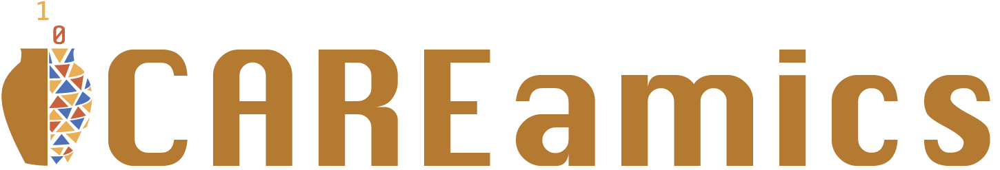

# Documentation

CAREamics is a PyTorch library aimed at simplifying the use of Noise2Void and its many
variants and cousins (N2V2, P(P)N2V, HDN etc.).

## Why CAREamics?

Noise2Void is a widely used denoising algorithm, and is readily available from the `n2v`
python package. However, n2v is based on TensorFlow and Keras and we found it 
increasingly hard to maintain. In addition, more recent methods (PPN2V, DivNoising,
HDN) are all implemented in PyTorch, but are lacking the extra features that would make
them usable by the community.

The aim of CAREamics is to provide a PyTorch library reuniting all the latest methods
in one package, while providing a simple and consistent API. In addition, we will
provide extensive documentation and tutorials on how to best apply these methods in a
scientific context.

## Getting Started

    

        <!-- Architecture as building blocks -->
        

            

                

                    <!-- Installation -->
                    <a class="card-wrapper" href="installation">
                        
 
                            

                                
                                    --8<--  "desktop-download.svg"
                                
                            

                            

                                <h5>Installation</h5>
                                

                                    Get started with CAREamics installation.
                                

                            

                        

                    </a>
                    <!-- Current state -->
                    <a class="card-wrapper" href="current_state">
                        

                            

                                
                                    --8<-- "milestone.svg"
                                
                            

                            

                                <h5>Current State</h5>
                                

                                    Check out where we stand and where we want to go.
                                

                            

                        

                    </a>
                

                

                    <!-- Guides -->
                    <a class="card-wrapper" href="guides">
                        

                            

                                
                                    --8<-- "repo.svg"
                                
                            

                            

                                <h5>Guides</h5>
                                

                                    In-depth guides on CAREamics usage and features.
                                

                            

                        

                    </a>
                    <!-- Application -->
                    <a class="card-wrapper" href="applications">
                        

                            

                                
                                    --8<-- "file-media.svg"
                                
                            

                            

                                <h5>Applications</h5>
                                

                                    Examples of CAREamics in action on various datasets.
                                

                            

                        

                    </a>
                

                

                    <!-- Algorithms -->
                    <a class="card-wrapper" href="algorithms">
                        

                            

                                
                                    --8<-- "cpu.svg"
                                
                            

                            

                                <h5>Algorithms</h5>
                                

                                    Dive into the various CAREamics algorithms.
                                

                            

                        

                    </a>
                    <!-- Code reference -->
                    <a class="card-wrapper" href="applications">
                        

                            

                                
                                    --8<-- "code.svg"
                                
                            

                            

                                <h5>Code Reference</h5>
                                

                                    Code documentation for all CAREamics libraries.
                                

                            

                        

                    </a>
                

            

        

    

## Feedback

We are always welcoming feedback on what to improve of what features could be useful,
therefore do not hesitate to open an issue on the
[Github repository](https://github.com/CAREamics/careamics)!
<!-- 
## Cite us -->